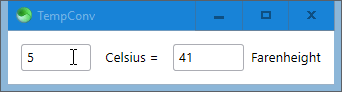
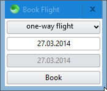
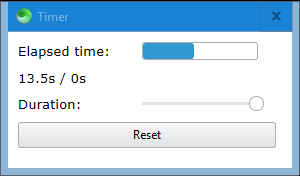
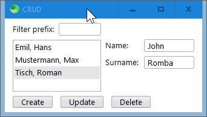
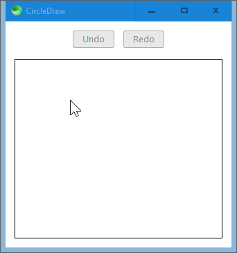
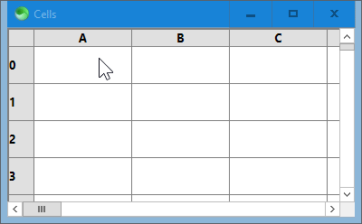

# Sciter.JS 7GUIs

[7GUIs](https://eugenkiss.github.io/7guis/tasks) benchmarks implemented in [Sciter.JS](https://sciter.com).

Run the examples by executing [scapp.exe](https://github.com/c-smile/sciter-js-sdk/blob/main/bin/windows/x64/scapp.exe) in each folder.

## Counter

## Temperature Converter

## Flight Booker

## Timer

## CRUD

## Circle Drawer

## Cells

Double-click to enter a value, and press `ENTER` to submit it.

Submitting `=A0` will set the cell equal to cell `A0`.

Submitting `=sum(A0:Z99)` will set the cell to the sum of `A0` and `Z99`.

The complete list of supported operations is `sum`, `sub`, `mul`, and `div`.