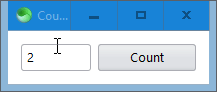
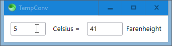
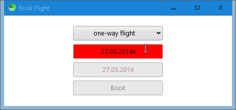
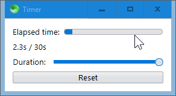
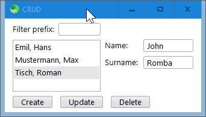
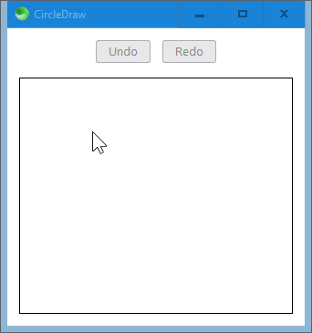

# SciterJS 7GUIs

[7GUIs](https://eugenkiss.github.io/7guis/tasks) benchmarks implemented in [SciterJS](https://sciter.com).

Run the implementations by running [scapp.exe](https://github.com/c-smile/sciter-js-sdk/blob/main/bin/windows/x64/scapp.exe) in each folder.

## Counter

## Temperature Converter

## Flight Booker

## Timer

## CRUD

## Circle Drawer

## Cells

:construction: Not yet implemented. :construction: