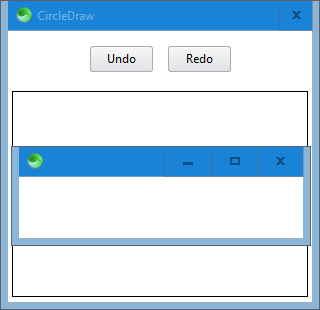

# SciterJS 7GUIs

[7GUIs](https://eugenkiss.github.io/7guis/tasks) benchmarks implemented in [SciterJS](https://sciter.com).

Run the implementations by placing [scapp.exe](https://github.com/c-smile/sciter-js-sdk/tree/main/bin.win/x32) in this folder and running the appropriate `.bat` file.
_____________
At the time of this writing, the `x32` version seems to support things the `x64` version does not.  And the *"work in progress"* benchmarks are halted because JavaScript features they require are not yet implemented in SciterJS (`11/2/2020`).

## Counter

## Temperature Converter

## Flight Booker

:construction: Work in progress. :construction:

## Timer

## CRUD

:construction: Work in progress. :construction:

## Circle Drawer

:construction: Work in progress. :construction:

## Cells

:construction: Not yet implemented. :construction: