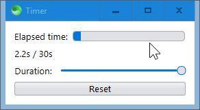

# SciterJS 7GUIs

:construction: Work in progress.

[7GUIs](https://eugenkiss.github.io/7guis/tasks) benchmarks implemented in [SciterJS](https://sciter.com).

Run the implementations by running [scapp.exe](https://github.com/c-smile/sciter-js-sdk/tree/main/bin.win/x32) in each folder.

## Counter

## Temperature Converter

## Flight Booker

:construction: Work in progress. :construction:

## Timer

## CRUD

:construction: Work in progress. :construction:

## Circle Drawer

:construction: Work in progress. :construction:

## Cells

:construction: Not yet implemented. :construction: